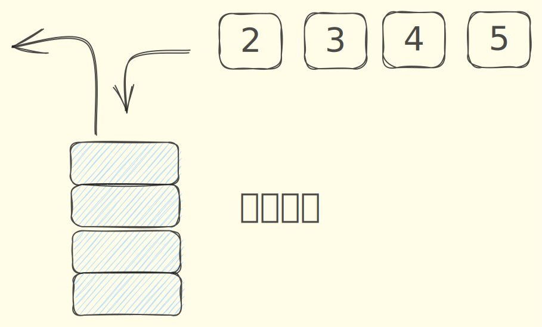
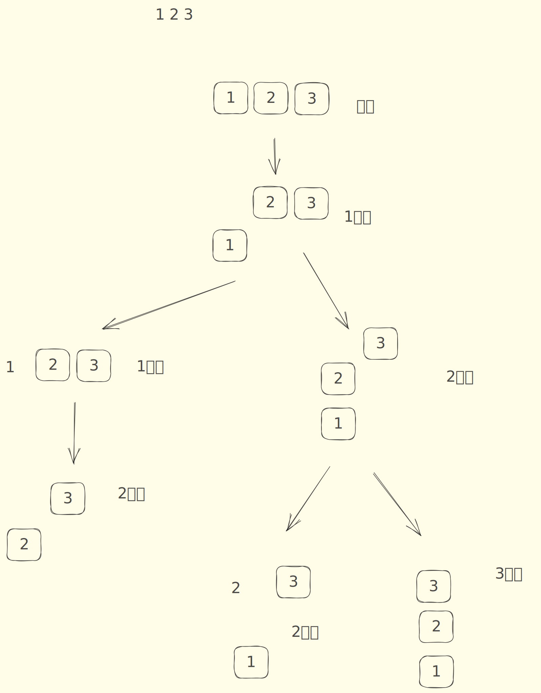
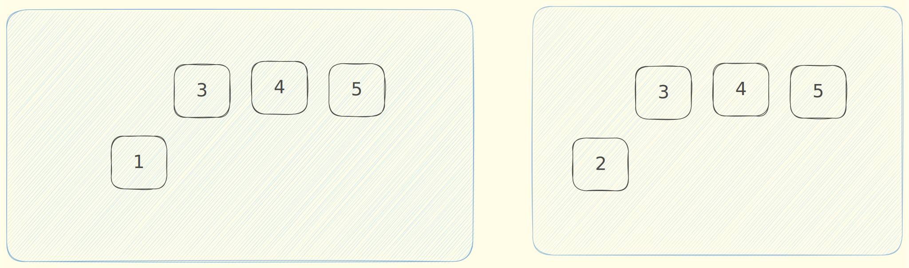

## 解析

一个序列进栈顺序为`1,2,3....N`,问可能的出栈可能序列有多少种?

哇,这个一个经典的题目有多种解法

###  解法1,搜索


我们按时间的设定状态,某一个时刻,有一个状态如下



显然对于每个关有两种操作

1. 入栈
2. 出栈(栈非空)

那总共有多少状态呢?(1 + 2 +3+4...n)所以时间复杂度为`2^(n(n+1)/2)`

### 解法2: 递推

**第二种是递推** O(n2)，本题只要求计算出方案数，而非具体方案，于是可以通过递推直接进行统计

设 SN​ 表示进栈顺序为 1,2,⋯,N 时可能的出栈序列总数，根据递推理论，将问题分解成若干类似子问题

考虑 “1” 这个数排在最终出栈序列中的位置，如果最后 “1” 这个数排在第 k 个，那么整个序列进出栈过程为：

1.  整数 1 入栈
2.  整数 2 ~ k 这 k−1 个数按某种顺序进出栈
3.  整数 1 出栈，排在第 k 位
4.  整数 k+1 ~ N 这 N−k 个数按某种顺序进出栈

整个问题就变被 “1” 这个数划分成了 “k−1 个数进出栈” 和 “N−k 个数进出栈” 这两个子问题，得到递推式如下：

```
SN​=i=1∑N​(Si−1​×Sn−i​)
```

显然我们需要一个双重循环来写这个题目,那时间复杂度为`N^2`

## 解析3: DP

如图



发现这个过程,就是一个dfs树,也就是无环,显然是可以dp的,那么就需要我们找到一种描述这种每一个点的状态,

如果需要完美的描述一个树上的一个点,那是不可能的,如下图



这个两状态如果想要精确描述,显然要精确到每个一个栈内的数字,这显然不可能.但我们可以用下面的方法,同时描述这两个状态.

用 f[i,j] 表示当前有 i 个数从栈中移出，有 j 个数还在栈中的方案总数

状态计算根据最后一步进行递推，可能是栈中数字出栈，也可能是新数字加入栈中，有递推式： 

```
f[i,j]=f[i−1,j+1]+f[i,j−1]

```
时间复杂度: 大概有`n^2`个状态.

## catalan数

这个题目的`n= 60000`,显然`N^2`算法都过不了,只能用`catalan`这个算法来算,这是一个数学算法

我们需要知道是这个算法与`进出栈`有什么关系. 

## 代码

