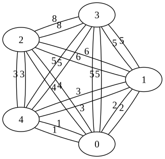

## 解析

题目大意:从20点的图里,找到最短有路径,使每个点只经过一次

因为点只有20个,可以用二进制状态压缩.

共有`(1<<20)-1 = 1048575`个表示点的状态

设`f[state,j]`,表示现在的状为`state`,且现在正在`j`点时的最短路径,显然`(state >>j) & 1  == 1`

那么状态转移方程为

```
f[state1,j] = min{ f[state_2,k] + dis(j,k)}
```

其中`(state_2 >> j) & 1 == 0, clear state1 at position j == state_2`

`state2 < state1` ,所以我们从小到大枚举`state`

时间复杂度为`( (1<<20)-1) *20 = 20971500 = 2 x 10^7`

> 最坑的是:我没有认真的看题目,应该起点是0,终点是n-1,我算成为任意起点,终点.
> 导致我调试了两个小时 😢

附一个我调试时,生成的图



## 代码

```c
<%- include("2.cpp") %>
```
