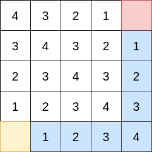

@[toc]
## 分析

样例给了提示:两个点花多少时间能连一起

::: center
```viz-dot
graph title {
    node[shape=plaintext  fillcolor=white colorscheme=accent8 ];
    a[ label=< <TABLE CELLBORDER="1" BORDER="0" CELLSPACING="0" CELLPADDING="5">
            <tr>
                <td PORT="" bgcolor="1" >1</td>
                <td PORT="">2</td>
                <td PORT="">3</td>
                <td PORT="">4</td>
                <td PORT="">5</td>
                <td PORT="" bgcolor="1">6</td>
            </tr>
        </TABLE> > ]
}
```

```viz-dot
graph title {
    node[shape=plaintext  fillcolor=white colorscheme=accent8 ];
    a[ label=< <TABLE CELLBORDER="1" BORDER="0" CELLSPACING="0" CELLPADDING="5">
            <tr>
                <td PORT="" bgcolor="1" >1</td>
                <td PORT="">2</td>
                <td PORT="">3</td>
                <td PORT="">4</td>
                <td PORT="" bgcolor="1">5</td>
            </tr>
        </TABLE> > ]
}
```
:::

如果在一条线上,显然时间为$((j-i-1)-1) \div 2+1 \rightarrow (j-i) \div 2$


::: center

:::

经过分析显然和曼哈顿距离有关系,$(abs(x_1-x_2)+abs(y_1-y_2) ) \div 2$ 

一个题目说的不详细的地方:a与b连通,b与c连通,那么a与c连通,这显然是一种集合的思想,要用并查集.

| 曼哈顿距离 | 时间 |
|------------|------|
| 1          | 1    |
| 2          | 1    |
| 3          | 2    |
| 4          | 3    |

==>$(abs(x_1-x_2)+abs(y_1-y_2) +1) \div 2 <= give_time $

## 代码

```c
<%- include("1.cpp") %>
```
