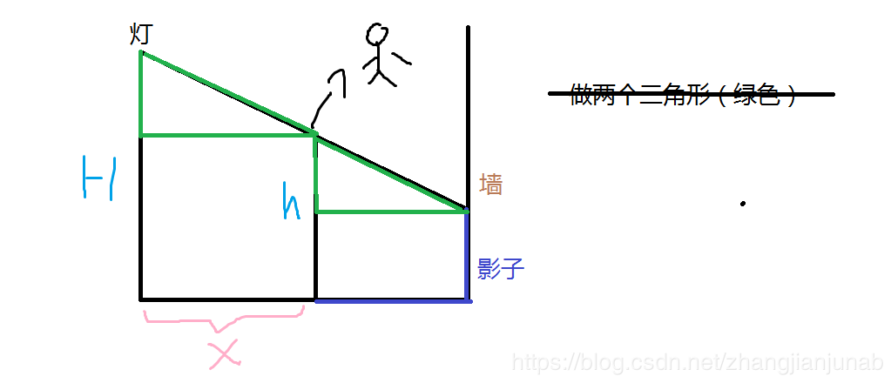
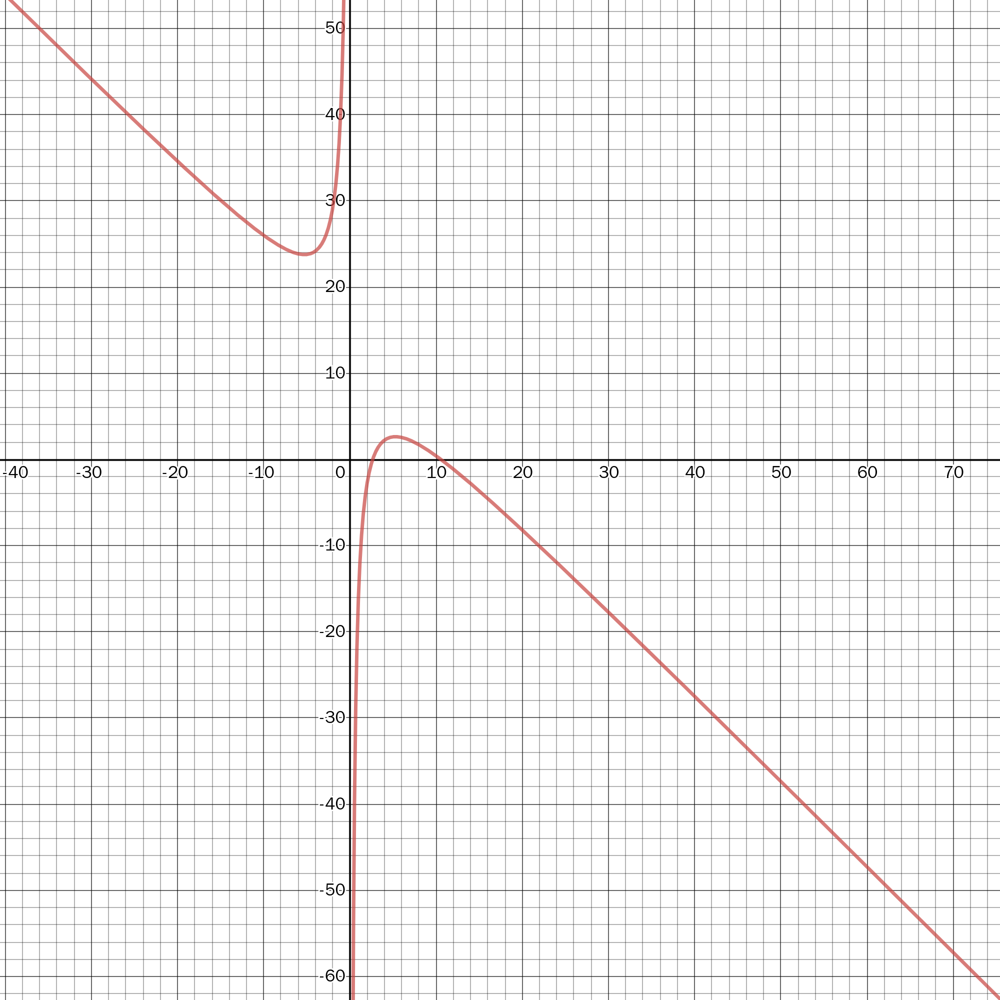

@[toc]
## 分析

先写出数学公式: 汗，因为选用了不好的做图，算了很长的一段时间没有得到想要的公式：

::: center

:::


但真的好算的图如下：



最终得到公式：

$$
L = D+H-(x+(H-h)*D/x)
$$

我根据公式生成的图像：



发现是一个上凸函数。用三分啊。

## 代码

```c
<%- include("1.cpp") %>
```


## 参考

- [「一本通 1.2 练习 3」灯泡（三分/公式法）（三角函数，计算几何） - 敌敌畏58 - 博客园](https://www.cnblogs.com/zhangjianjunab/p/9855482.html)
