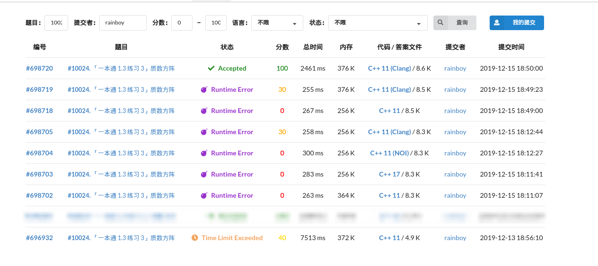

@[toc]

## 分析

**大毒瘤题目:rage::rage::rage:!!!!!** **还是我太弱了 :sob: :sob: :sob:**

学会了:

 - 预处理,剔除不要的搜索对象
 - 多重循环,超级暴力搜索时,要有耐心,**一边写一边进行代码中间结果的检查**
 - 码风要清晰易懂,不要相信自己的临时记忆
 - 越早的剪枝,效果越好
 - 一个好的dfs搜索框架,按框架写出错的机会小
 - `vector<int> a; int siz = a.size()-1`,siz有可能不是$-1$,因为`a.size()`返回的数据类型的原因


我的搜索方法如下:

 - 枚举出所有和为n的素数
 - 枚举填写$1,1 \rightarrow 5,5$对角线上的数
 - 枚举填写第一行,第一列的数,不能包含0
 - 枚举填写第5行,第5列的数,不能包含偶数的位,且开头结尾已经固定
 - 还剩下6个格子,只要其中的一个格子填入数字,其它5个格子的数就确定了,所以枚举$0 \rightarrow 9$填入$[2,3]$,然后判断其它的数字是否成立
    - 具体看`final_put`这个函数
 - 判断第2列是否可行
 - 判断另一条斜线是否可行
 - 把结果转成string,存入vector
 - sort结果,转化输出


痛苦的记忆: **三天的时间才做出来**


## 代码

注意代码中有很多调试的代码,阅读体验不好

```c
<%- include("1.cpp") %>
```


## 参考:

[建立在Trie树上的搜索](https://blog.csdn.net/baidu_23081367/article/details/45780241)
