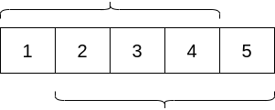

@[toc]
## 分析


这里要用到循环节的相关性质.

很容易就想到:

- 如果循环节长度为1

::: center
 
:::

- 如果循环节长度为2,那么长度为偶数.

进一步可以想到:个长度为len的子串，它的循环节一定是len的约数，所以只要找len的约数，再用hash判断就行了。但是这样的复杂度是q√n的，会TLE，所以考虑优化。

卡在上面


如果一个字符串的长度为30,求它的最小循环节,根据整数唯一分解定理知:$30=2 \times 3 \times 5$,那么最小循环节可能是:

$$
1,
2,
3,
5,
2 \times 3 ,
2 \times 5 ,
3 \times 5 ,
2 \times 3 \times 5
$$

也就是30的所有的约数都要尝试一遍,但是在loj上这样做会TLE.我们要寻找更快速的方法.


变成一个新的问题:**x是n的约数时f(x)才会成立,且如果x成立,则x\*k也是n的约数,那f(x*k)也成立.求最小的x.**

核心思想:**去除**质因数

设a是n的质因数,如果a是可去除的($a,a*k$都不符合条件),那a就是可以++去除++的,那如何判断a是可以去除的呢?

$n= a_1 \times a_2 \cdots \times a_i$,$a_i$都是n的质因数

如果$y= a_2 \times \cdots \times a_i$ 成立,则显然不包含$a_1$,可以去除$a_1$

```
for a in {n的质因数}:
    t = n/a;
    if f(n) 成立
        n = t;
```

上面就可以依次去.

如何求n的质因数?,我们其实要求的是[1,n]每个数的质因数.所以:用**线性筛素数**求出每个数的最小质因数,然后分解,具体看代码.


## 代码


```c
<%- include("1.cpp") %>
```

## 参考

 - [bzoj-2795   A Horrible Poem_140142-CSDN博客](https://blog.csdn.net/ww140142/article/details/48260615)
 - [A Horrible Poem （字符串hash+数论） - 飞飞翔滴少年 - 博客园](https://www.cnblogs.com/Willendless/p/9604604.html)
 - [2795: 「Poi2012」A Horrible Poem - 神犇（shenben） - 博客园](https://www.cnblogs.com/shenben/p/6251163.html?utm_source=itdadao&utm_medium=referral)
