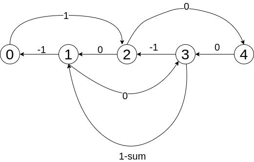

@[toc]
## 分析

关键词:区间覆盖,圆形.

## 解析


```viz-dot
graph g{
    layout="circo";
    mindist=.1;
    edge[style=invis]
    node[shape=circle fixedsize=true style=filled fillcolor=white colorscheme=accent8 ];
    8--9--10--11--12--13--14--15--16--17--18--19--20--21--22--23--24[style=invis];
    24--1[style=invis];
    1--2--3--4--5--6--7;
    7--8;
    23,24,1,2,3,4,5,6[fillcolor=2];
}
```
首先把所有的时间加1,方便计算.然后设:
 - $r[i]$:时间i应该有的人数
 - $num[i]$::时间i申请的人数
 - $s[i]$:时间$0\rightarrow i$申请的人数和,也就是num[i]的前缀和
 - $sum$:最终雇用的人数,显然$s[24] = sum$

可以想到:

- $s[i] - s[i-1] \leqslant num[i]$
  - $s[i-1] - s[i] \geqslant -num[i]$
- $s[i] - s[i-1] \geqslant 0$
- $s[i] - s[i-8] \geqslant r[i],i-8 \geqslant 0$
- $s[i] + s[24]-s[j] \geqslant r[i] , i < j,1 \leqslant i \leqslant 7,j-i==16$
  - $s[i] - s[j] \geqslant r[i]-s[24]$
  - $s[i] - s[j] \geqslant r[i]-num$
- $s[24] - s[0] \geqslant num$


上面的不等式转成图之后是否具有数学含义?


```viz-dot
graph g{
    layout="circo";
    mindist=0.5;
    edge[style=invis]
    node[shape=circle fixedsize=true style=filled fillcolor=white colorscheme=accent8 ];
    3--4--1;
    1--2;
    2--3;
    1[xlabel=1]
    2[xlabel=1]
    3[xlabel=0]
    4[xlabel=0]
}
```



sum其实就是我们最终所求的答案,可以枚举


## 体会

如何判断一个题目是**差分约束系统**:

 - 可以写出多个差分不等式
 - 求最大最小值


如何写出差分不等式:

 - 保证正确
 - 不要少写
 - 多写只要正确,应该没有问题


其他

 - 因为数据是圆形,所以要枚举一下,最后一个未知值.

## 代码

```c
<%- include("1.cpp") %>
```

## 参考

- [1755 【差分约束】Cashier Employment(出纳员的雇佣)](https://wenku.baidu.com/view/0014cdf44693daef5ef73dc0.html)
