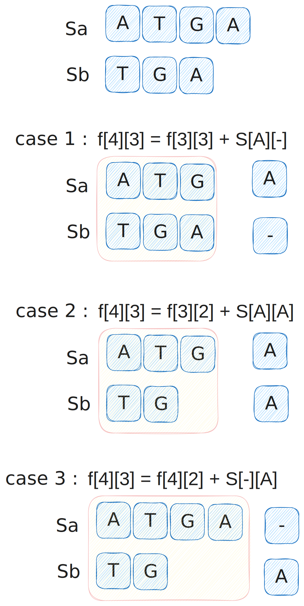

@[toc]

## 题目

### 题目背景 
大家都知道，基因可以看作一个碱基对序列。它包含了 $4$ 种核苷酸，简记作 `A, C, G, T`。生物学家正致力于寻找人类基因的功能，以利用于诊断疾病和发明药物。

在一个人类基因工作组的任务中，生物学家研究的是：两个基因的相似程度。因为这个研究对疾病的治疗有着非同寻常的作用。


### 题目描述

两个基因的相似度的计算方法如下：

对于两个已知基因，例如 `AGTGATG` 和 `GTTAG`，将它们的碱基互相对应。当然，中间可以加入一些空碱基 `-`，例如：

$$
\def\arraystretch{1.5}
\begin{array}{|c|c|c|c|c|c|c|c|} \hline
\tt A & \tt G & \tt T & \tt G & \tt A & \tt T & \texttt - & \tt G \\ \hline
\texttt - & \tt G & \tt T & \texttt - & \texttt - & \tt T & \texttt A & \tt G \\ \hline
\end{array}
$$

这样，两个基因之间的相似度就可以用碱基之间相似度的总和来描述，碱基之间的相似度如下表所示：

$$
\def\arraystretch{1.5}
\begin{array}{ |c|c|c|c|c|c|} \hline
& \tt A & \tt C & \tt G & \tt T & \texttt - \\ \hline
\tt A & 5 & -1 & -2 & -1 & -3\\ \hline
\tt C & -1 & 5 & -3 & -2 & -4 \\\hline
\tt G & -2 & -3 & 5 & -2 & -2 \\\hline
\tt T & -1 & -2 & -2 & 5 & -1 \\\hline
\texttt - & -3 & -4 & -2 & -1 & * \\\hline
\end{array}
$$ 

那么相似度就是：$(-3)+5+5+(-2)+(-3)+5+(-3)+5=9$。因为两个基因的对应方法不唯一，例如又有：

$$
\def\arraystretch{1.5}
\begin{array}{|c|c|c|c|c|c|c|} \hline
\tt A & \tt G & \tt T & \tt G & \tt A & \tt T & \tt G \\ \hline
\texttt - & \tt G & \tt T & \texttt T & \texttt A & \texttt - & \tt G \\ \hline
\end{array}
$$

相似度为：$(-3)+5+5+(-2)+5+(-1)+5=14$。规定两个基因的相似度为所有对应方法中，相似度最大的那个。


### 输入格式
共两行。每行首先是一个整数 $n$，表示基因序列的长度；隔一个空格后是一个基因序列，序列中只含 $\verb!A!,\verb!C!,\verb!G!,\verb!T!$ 四种字母。$1 \le n\le 100$。


### 输出格式

仅一行，即输入基因的相似度。


### 样例


输入/输出 # 1

::: line
```
7 AGTGATG
5 GTTAG

```

```
14

```
:::


## 解析

应该很轻松的就相到这个题目是lcs问题的变种问题,因为都是两行字符串,且都是两行字符串的匹配问题

对于两个字符串sa,sb来说,`f[i][j]`就表示sa前面i个字符,与sb前面j个字符能得到的最大值

那么整个问题的答案就是`f[len(sa)][len(sb)]`

那应该如果的去分解子问题呢?




显然有三种情

- 1. 使sa的最后一个元素和`-`配对
- 2. 使sa的最后一个元素和sb的最后一个远程配对
- 3. 使sb的最后一个元素和`-`配对

显然这三种情况的最大值就是`f[4][3]`的最大值

其中`s[A][-]` 表示A与-配对得到的值

那么,显然我们可以写出下面的状态转移方程:

```

int a = f[i-1][j] + s[sa[i]]['-']
int b = f[i-1][j-1] + s[sa[i]][sb[j]]
int c = f[i-1][j-1] + s['-'][sb[j]]

f[i][j] = max(a,b,c)
```

好么边界条件是什么呢?

显然

`f[0][0] =0 `,表示,两个字符串的长度都是0的条件下,值为0

`f[i][0]`,表示sb的长度为0的值,这个值显然是每个sa的前i个字符,每个字符都与`-`配对的和

`f[0][j]`同理.


## 代码

```c
<%- include("1.cpp") %>
```
