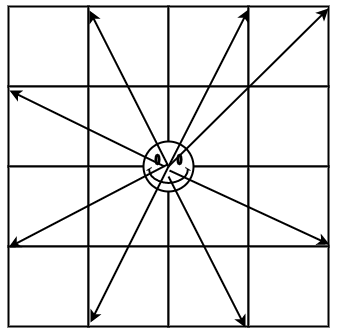

@[toc]

## 题目


### 题目描述

有一个n\*m的棋盘(1<n,m<=400)，在某个点上有一个马,要求你计算出马到达棋盘上任意一个点最少要走几步


### 输入格式
一行四个数据，棋盘的大小和马的坐标


### 输出格式

一个n\*m的矩阵，代表马到达某个点最少要走几步（左对齐，宽5格，不能到达则输出-1）


### 样例

|----|----|
|输入 #1  |输出 #1  |
|```  |```  \
|3 3 1 1  |0    3    2      \
|  |3    -1   1      \
|```  |2    1    4      \
|   |```  |


## 分析

马可以跳八个方向:



所以可以这样定义

```c
int fx[][2] = { {1,-2},{2,-1},{2,1},{1,2},{-1,2},{-2,1},{-2,-1},{-1,-2} };
```

具体的做法如下:

 - 使用BFS来做,因为bfs是**广度**的,第一次遇到的点就是走一步就到的点
 - `visited[i][j]`表示是否已经来到点`i,j`
 -  当队列为空的时候结束

## 代码:


```c
#include <iostream>
#include <cstring>
#include <cstdio>
using namespace std;
#define N 410
int map[N][N];
int visited[N][N] = {0};
int n,m;
int sx,sy; // start_x
int fx[][2] = { {1,-2},{2,-1},{2,1},{1,2},{-1,2},{-2,1},{-2,-1},{-1,-2} };


struct _node{
	int x,y;
	int step;
};

_node queue[400*400];
int head=0,tail=0;

void push(int x,int y,int step){
	queue[tail].x = x;
	queue[tail].y =y ;
	queue[tail].step = step;
	tail++;
}

void pop(){
	head++;
}
void front(int &x,int &y,int &step){
	x = queue[head].x;
	y = queue[head].y;
	step = queue[head].step;
}
bool empty(){
	if( head == tail)
		return true;
	return false;
}


bool inmap(int x,int y){
	if( x >=1 && x <=n && y >=1 && y <=m) 
		return true;
	return false;
}

void bfs(int x,int y){
	visited[x][y] =1;
	map[x][y] = 0;
	push(x,y,0);

	while(empty() == false){
		int tx,ty,ts;
		front(tx,ty,ts); pop();
		int i;
		for(i=0;i<8;i++){
			int nx = tx + fx[i][0];
			int ny = ty + fx[i][1];
			if( inmap(nx,ny) && visited[nx][ny] == 0){
				push(nx,ny,ts+1);
				visited[nx][ny] = 1;
				map[nx][ny] = ts+1;
			}
		}
	}

}

int main(){
	memset(map,-1,sizeof(map));
	cin >> n >> m >> sx >> sy;
	bfs(sx,sy);
	int i,j;
	for(i=1;i<=n;i++){ // 注意这里n*m 表示n行 m列
		for(j=1;j<=m;j++){
			printf("%-5d",map[i][j]);
		}
		printf("\n");
	}

	return 0;
}
```
