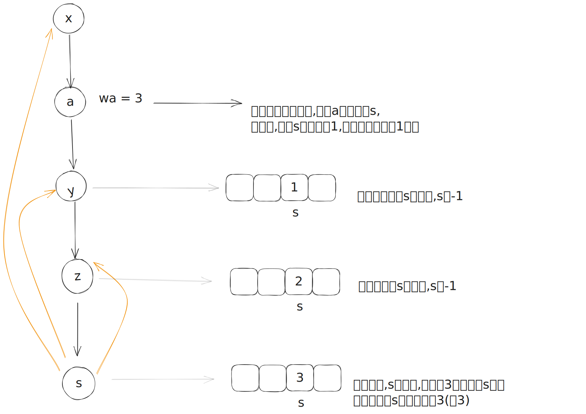
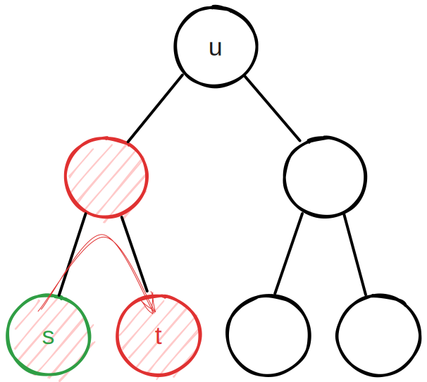
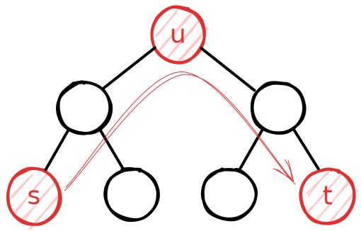
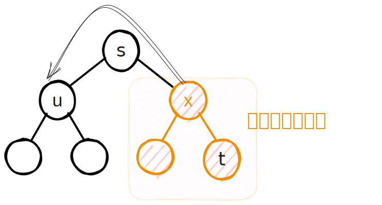

@[toc]

## 题目


### 题目描述

`小c` 同学认为跑步非常有趣，于是决定制作一款叫做《天天爱跑步》的游戏。《天天爱跑步》是一个养成类游戏，需要玩家每天按时上线,完成打卡任务。

这个游戏的地图可以看作一一棵包含 $n$ 个结点和 $n-1$ 条边的树，每条边连接两个结点,且任意两个结点存在一条路径互相可达。树上结点编号为从 $1$ 到 $n$ 的连续正整数。

现在有 $m$ 个玩家，第 $i$ 个玩家的起点为 $s_i$，终点为 $t_i$。每天打卡任务开始时，所有玩家在第 $0$ 秒同时从自己的起点出发，以每秒跑一条边的速度，不间断地沿着最短路径向着自己的终点跑去，跑到终点后该玩家就算完成了打卡任务。 (由于地图是一棵树，所以每个人的路径是唯一的)

`小c` 想知道游戏的活跃度，所以在每个结点上都放置了一个观察员。在结点 $j$ 的观察员会选择在第 $w_j$ 秒观察玩家，一个玩家能被这个观察员观察到当且仅当该玩家在第 $w_j$ 秒也正好到达了结点 $j$ 。`小c` 想知道每个观察员会观察到多少人?

注意：我们认为一个玩家到达自己的终点后该玩家就会结束游戏，他不能等待一 段时间后再被观察员观察到。 即对于把结点 $j$ 作为终点的玩家：若他在第 $w_j$ 秒前到达终点,则在结点 $j$ 的观察员不能观察到该玩家；若他正好在第 $w_j$ 秒到达终点,则在结点 $j$ 的观察员可以观察到这个玩家。


### 输入格式
第一行有两个整数 $n$ 和 $m$。其中 $n$ 代表树的结点数量, 同时也是观察员的数量, $m$ 代表玩家的数量。

接下来 $n-1$ 行每行两个整数 $u$ 和 $v$，表示结点 $u$ 到结点 $v$ 有一条边。

接下来一行 $n$ 个整数，其中第 $j$ 个整数为 $w_j$ , 表示结点 $j$ 出现观察员的时间。

接下来 $m$ 行，每行两个整数 $s_i$，和 $t_i$，表示一个玩家的起点和终点。

对于所有的数据，保证 $1\leq s_i,t_i\leq n, 0\leq w_j\leq n$。


### 输出格式

输出 $1$ 行 $n$ 个整数，第 $j$ 个整数表示结点 $j$ 的观察员可以观察到多少人。


### 样例


输入/输出 # 1

::: line
```
6 3
2 3
1 2 
1 4 
4 5 
4 6 
0 2 5 1 2 3 
1 5 
1 3 
2 6 
```

```
2 0 0 1 1 1 
```
:::

输入/输出 # 2

::: line
```
5 3 
1 2 
2 3 
2 4 
1 5 
0 1 0 3 0 
3 1 
1 4
5 5 
```

```
1 2 1 0 1 
```
:::


### 说明/提示
【样例1说明】

对于 $1$ 号点，$w_i=0$，故只有起点为 $1$ 号点的玩家才会被观察到，所以玩家 $1$ 和玩家 $2$ 被观察到，共有 $2$ 人被观察到。

对于 $2$ 号点，没有玩家在第 $2$ 秒时在此结点，共 $0$ 人被观察到。

对于 $3$ 号点，没有玩家在第 $5$ 秒时在此结点，共 $0$ 人被观察到。

对于 $4$ 号点，玩家 $1$ 被观察到，共 $1$ 人被观察到。

对于 $5$ 号点，玩家 $1$ 被观察到，共 $1$ 人被观察到。

对于 $6$ 号点，玩家 $3$ 被观察到，共 $1$ 人被观察到。

【子任务】

每个测试点的数据规模及特点如下表所示。  
 提示: 数据范围的个位上的数字可以帮助判断是哪一种数据类型。

  

【提示】

如果你的程序需要用到较大的栈空间 (这通常意味着需要较深层数的递归), 请务必仔细阅读选手目录下的文本文档 running/stack.txt, 以了解在最终评测时栈空间的限制与在当前工作环境下调整栈空间限制的方法。

在最终评测时，调用栈占用的空间大小不会有单独的限制，但在我们的工作环境中默认会有 $1 \text{MiB}$ 的限制。 这可能会引起函数调用层数较多时， 程序发生栈溢出崩溃。

我们可以使用一些方法修改调用栈的大小限制。 例如， 在终端中输入下列命令
`ulimit -s 1048576`

此命令的意义是，将调用栈的大小限制修改为 $1 \text{GiB}$。

例如，在选手目录建立如下 sample.cpp 或 sample.pas


  

将上述源代码编译为可执行文件 sample 后，可以在终端中运行如下命令运行该程序

./sample

如果在没有使用命令“ ulimit -s 1048576”的情况下运行该程序， sample 会因为栈溢出而崩溃； 如果使用了上述命令后运行该程序，该程序则不会崩溃。

特别地， 当你打开多个终端时， 它们并不会共享该命令， 你需要分别对它们运行该命令。

请注意， 调用栈占用的空间会计入总空间占用中， 和程序其他部分占用的内存共同受到内存限制。


## 解析

题目模型: 在一个树上,每个点有一个值$w_j$,同时有多对起点,终点$s_i,t_i$,当一个点$A$恰好在一条路径上,且距离起点的$s_i$的值恰好为$w_A$,点$A$就计数一次.最后输出每个点的计数.

**也就是说这一个树上统计问题**

### 1 测试点1-2

因为起点终点都一样,所以只有$w_j = 0$的点才能计数.时间$O(n)$

### 2 测试点3-4

所有的$w_j =0$,也就是只能观察到起点等于终点的路径,时间$O(m)$

### 3 测试点5

一个点为$993$的树,路径条数也为$993$,

针对每一条路径

1. 求出lca,时间$log(n)$
2. 根据lca遍历一次路径,对路径上的点$w_j$,进行计数,时间$O(n)$
3. 总时间$m^2log(n)$

可以接受

### 4 测试点6,7,8

树是一条链

如图,可以得知

- 每个点的深度$dep[i]$

哪果有一条路径$s,t$,$dep[s] > dep[t]$,也就是起点在下面,若这个起点$s$被点$a$观察到, 这里要满足条件

1. 以$s$点为起点的路径要经过a
2. $dep[s] - dep[a] == w_a$,也就是说$s,a$距离恰好是a的w值

可以使用二分的方法,
如果把所有以s为起点的点对按t值排序,那a点所能观察到的点的数量就是

```
lower_bound(s,s+n,a) - s
前半段,所以t值 <= a的数量
```
如何使用`树上差分`的思想来得到点a能观察的点数量呢?这里先只考虑$dep[s]> dep[t]$的情况

什么是**树上差分**?树上差分可以统计一树上的一个点被几条路径覆盖



它是这样设计的

- 初始所有的点的cnt值设为0
- 起点$s,t$的cnt值$+1$
- $lca(s,t)$的cnt值$-1$
- $fa[lca(s,t)]$的cnt值$-1$

这样对于每个点,只需要统计这个的子树上cnt的和,就是这个点被路径覆盖的数量


同样,我们想使用类似的思想,统计树上点a能观察到的起点s的数量


一个点s能被a,观察到,那么就符合这个公式:$dep[a]+w_a = dep[s]$

也就是说,对于观察点$a$,它需要知道的信息是

1. $a$的子树上(也就是深度大于$dep[a]$的点)深度为$dep[a] + w_a$的点的数量
2. 且这些点还没有结束

因为每个观察点的需要统计的深度不一样,所以我们开一个桶记录各个深度

下图,桶的下标$s$表示深度值,桶$s$记录的是起点深度为$s$的,还没有结束的路径的数量(或起点的数量).



如上图所示,我们可以知道在链上**如何统计观察点a下面的起点对a的贡献**,那如何**统计在观察点上面的起点对a的贡献呢?**

1. 可以把整个链倒来,按上图所示的方法来做
2. 按下面的方法来做


如果一个点终点t在观察点a的下面$dep[t] > dep[a]$,如果a能观察到起点s

显然$w_a = len(s,a)$

- 得出 $len(s,a) + dep[t] - dep[a] = len(s,t)$
- $w_a + dep[t] - dep[a] = len(s,t)$
- $w_a - dep[a] = len(s,t) - dep[t]$

同理,需要开一个桶来统计a下面的终点的信息,符合对应条件$len(s,t) - dep[t]$的终点数量



所以最终,需要开两个桶,

1. 一个统计$dep[s]$,起点
2. 一个统计$len(s,t) - dep[t]$,终点

时间为$O(n+m)$


### 5. 测试点 9,10,11,12

所有的起点都是1,我们把1做为整个树的根.那所有的起点都是根,那么

- 所有的$len(s,t) = dep[t]$
- 那么$len(s,t) - dep[t] = 0$
- 那么一个点a能观察到起点,显然$w_a = dep[a]$

根据上面的推论,只要用桶记录每个点下面的$len(s,t) -dep[t]$(就是0)的数量

### 6. 测试点 13,14,15,16

所有的终点都是1,我们把1做为整个树的根.那所有路径的终点都是根,那么

- 一个点a能观察到起点s,符合$dep[s] - dep[a]  =w_a$
- 移项:$dep[a]+w_a = dep[s]$

同样用一个桶去记录$dep[s]$,

此时,我们已经得到80分,用到的最核心的思想就是,

1. 桶的记录
2. 公式推导

### 7 测试点 17 18 19 20

最后的20分,此时是一个一般的树,$s,t$没有什么特点,但肯定也是用到的桶的统计方法.

先整理一下前面用到的信息

情况1: 如果一个起点s在u的子树上,且s能经过u,(要么u是s的lca,要么t不在u的子树上),如果u能观察到从s出发的人,那符合下面的公式

```
dep[s] - dep[u] = w[u] 
->
    dep[s] = dep[u] + w[u]
```

也就是在需要记录每个s点(起点)的`dep`值

情况2: 如果一个终点t在u的子树上,且s到t的路径经过u,(要么u是s,t的lca,要么s不在u的子树上),如果u能观察到s出发的w,那么符合下面的公式

```
w[u] + dep[t] - dep[u] = len(s,t)
-->
len(s,t) -dep[t] = w[u] - dep[u]
因为len(s,t) - dep[t]的最小值可能为-n,为了方便使用数组来记录对应的值
-->
len(s,t) -dep[t]+n = w[u] - dep[u]+n
```

此时我们已经有考虑了两种情况,对应前面的`1~16`这些测试点,只需要这两种情况可以解决,


但对于最后的测试点

情况3:

s,t都在u的子树上,但是`lca(s,t)`也在u的子树上(`lca(s,t) != u`) ,那么此时`s,t`都不应该对u进行贡献,



些时应该去除s,t的贡献(在🪣上记录):如果发现一个点是`s,t`的lca,那么应该把这个lca所对应的所有`s,t`的记录(桶🪣)都去除

情况4: 

s,t都在u的子树上,但是`lca(s,t) == u`,那么此时`s,t`都会应该对u进行贡献,也就是贡献了两次,但应该只记录一次就可以了



根据容斥原理,需要再减一次,那么

```
ans[u] = u子树上所有s,t贡献的和 - 以u为lca的(s,t)的数量
```

情况5:

当我们在dfs的过程中从x转移到u点时,桶上已经记录一些`s,t`的信息,但是这些`s,t`不在u的子树上,且这些`s,t`有可能从数值上来说能对u进行贡献(其实不应该贡献),




那我们应该如果去除这些额外的不正确的贡献值呢?

在dfs刚进入u值

```
ans[u] -=  桶🪣上的记录值
```

因为些时桶上的记录值,都是不应该的贡献值

## 代码1 过30分


::: fold
```c
<%- include("1.cpp") %>
```
:::

## 代码2,过100%的代码


::: fold
```c
<%- include("2_tran.cpp") %>
```
:::

## 新的思想 ,dsu on tree

dsu on tree, 树上启发式合并,是一种合并树上(点)相关信息的的技巧

它的核心如下,我简单的说一下

- 对树进行轻重点划分,轻儿子上的节点暴利,然后合并到重儿子的信息上,
  - 从轻儿子回溯时,暴力删除信息
- 一个点被访问的次数最多为`2*这个点到根上路径的轻边的条数`
- 总时间为`nlogn`


下面是一个使用dsu_on_tree的代码,但只得到了40分,没有使用对拍来确定,

不想写了,暂时这样吧

::: fold

```cpp
<%- include("3_tran.cpp") %>
```
:::

## 思考/总结

本题目,本质上是一个树上信息统计的题目

因为起点s,终点t,可以直接通过计算,得知对哪些点进行影响(贡献是多少),所以可以通过🪣的方式来进行统计信息

所以最终有一个`O(n+m)`的算法,也就是遍历一下就得到了答案

对于一个经典的树上信息统计的题目:`codeforce-600e`来说,因为**不能通过计算,得到点a对其它点的贡献(数量最多的颜色的数量,不能只看一个点,所以不能进行桶记录,),每一次只能暴力统计,此时只能用暴力统计,那加上一个dsu_on_tree就可以优化暴力


所以对于树上信息统计的题目,来说,

1. 如果能单点贡献,就可以`O(n)`,遍历一遍得到信息
2. 如果不能单点贡献,就是必需每次要统计所有点,那就用`dsu_on_tree`
