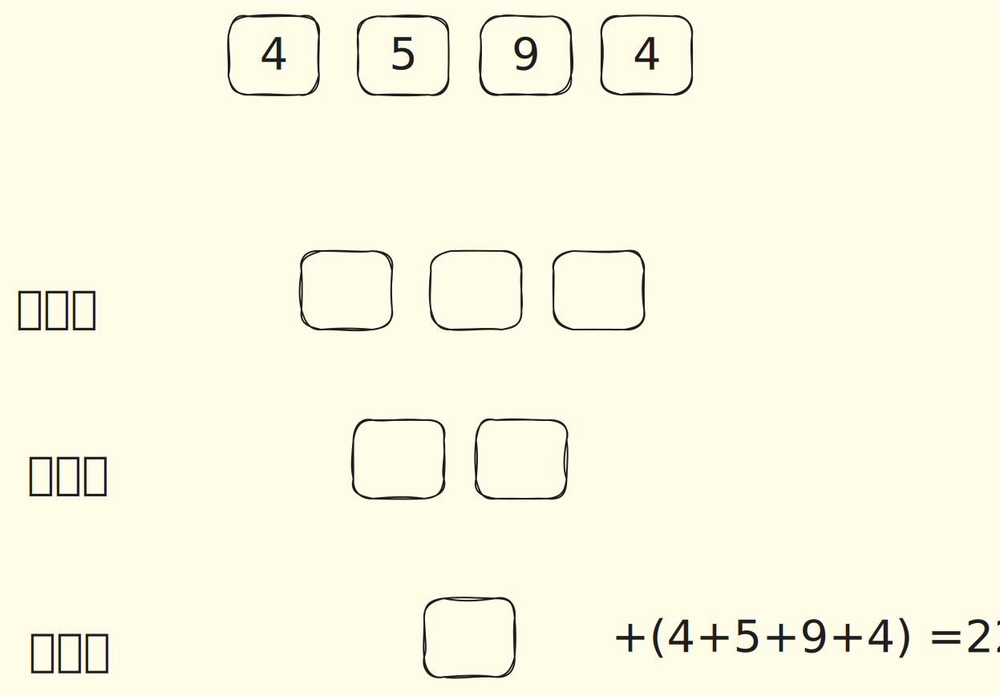
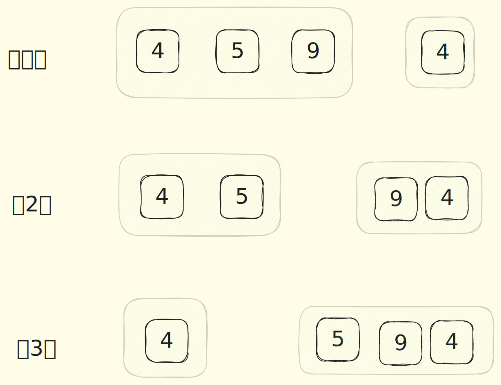
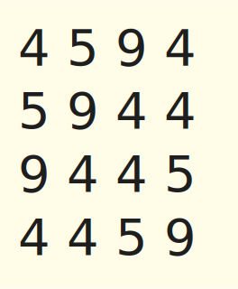
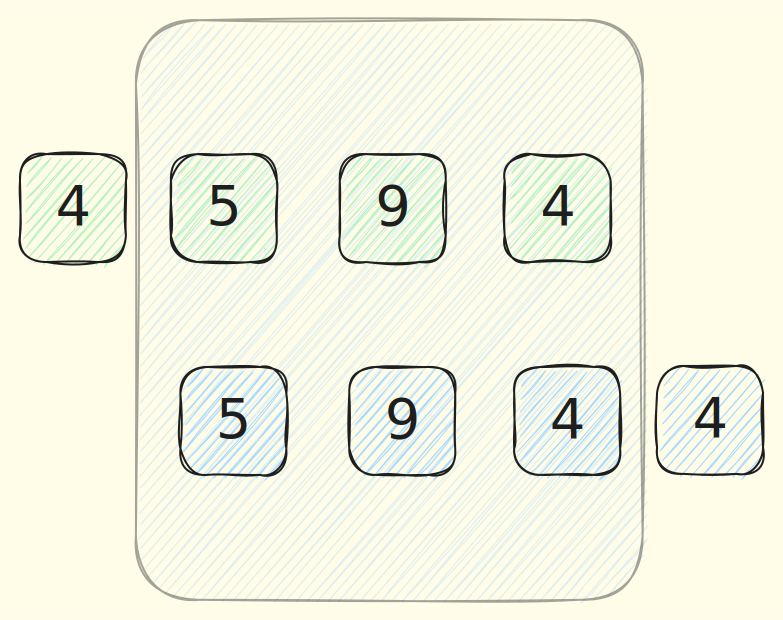
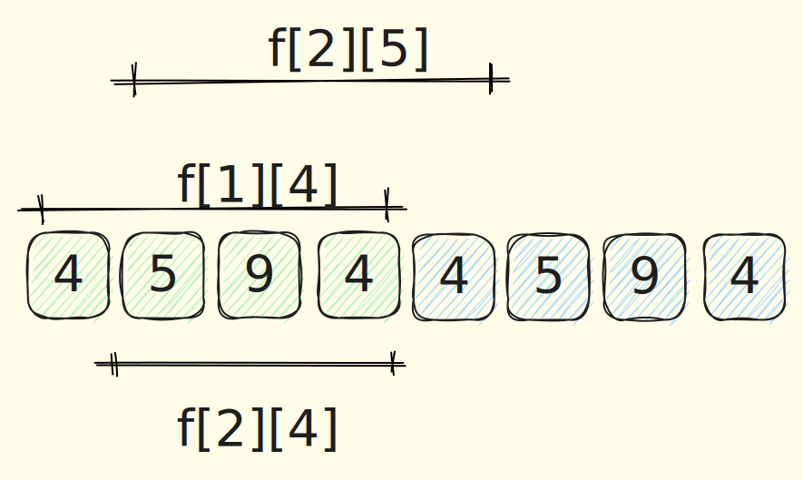

@[toc]

## 题目


### 题目描述

在一个圆形操场的四周摆放 $N$ 堆石子，现要将石子有次序地合并成一堆，规定每次只能选相邻的 $2$ 堆合并成新的一堆，并将新的一堆的石子数，记为该次合并的得分。

试设计出一个算法,计算出将 $N$ 堆石子合并成 $1$ 堆的最小得分和最大得分。


### 输入格式
数据的第 $1$ 行是正整数 $N$，表示有 $N$ 堆石子。

第 $2$ 行有 $N$ 个整数，第 $i$ 个整数 $a_i$ 表示第 $i$ 堆石子的个数。


### 输出格式

输出共 $2$ 行，第 $1$ 行为最小得分，第 $2$ 行为最大得分。


### 样例


输入/输出 # 1

::: line
```
4
4 5 9 4
```

```
43
54
```
:::


### 说明/提示
$1\leq N\leq 100$，$0\leq a_i\leq 20$。


## 解析


本题目是一个环形石子合并问题,它分为两个部分

1. 考虑非环,如果进行dp(区间dp)
2. 如果处理环

### 区间dp,非环形

我们先不考虑环的情况,认为就存在一个非环的4个石子`4,5,9,4`

这4石子一定是合并了3次,最后一次由2堆合并成1堆,最后一次的合并它的得到为`22`,因为最后一次的得分
一定4个识字的和.



这时候你需要想,最后一次合并是由两堆石子合并的? 有下面3种情况




所以你可以得到如下的状态转移方程

```
f[i,j] = max{ f[i,k] + f[k+1,j]} + sum(i,j)
i<=k < j
```

`f[i,j]`表示从第i个石子到第j个石子合并成一堆所得到的最大值

由此我们得到了,一个非环形的石子合并的状态转移方程,时间复杂度为`O(n^3)`


### 环形处理

我们把一个环从点i切开,可以得到如下4个链


此时,我们知道,**环形石子合并的最大值,一定是这4条链合并的最大值的最大值**,
但是这样我们需要求`n`次石子合并,总复杂度为`n^4`,无法接受




我们发现速度慢的原因是,**子问题的重复计算**,如下图




`5,9,4` 这个区间得到的答案应该是一样的,但是对于这两条链来说,它都需要单独的算一次


这时**我们把链1复制一个放到后面**

我们这条新的链,包含上面的4条链,分别是`a[1,4],a[2,5],a[3,6],a[4,7]`

那我们只需要这条链上求出`a[1,4],a[2,5],a[3,6],a[4,7]`(长度为4)这些区间合并成一个堆
的最值,就得出环形石子合并的最值,且时间复杂度为`n^3`

因为`f[2][4]`只需要求一遍,它可以同时给`f[1][4],f[2][5]`提供答案





## 代码

```c
<%- include("1.cpp") %>
```
