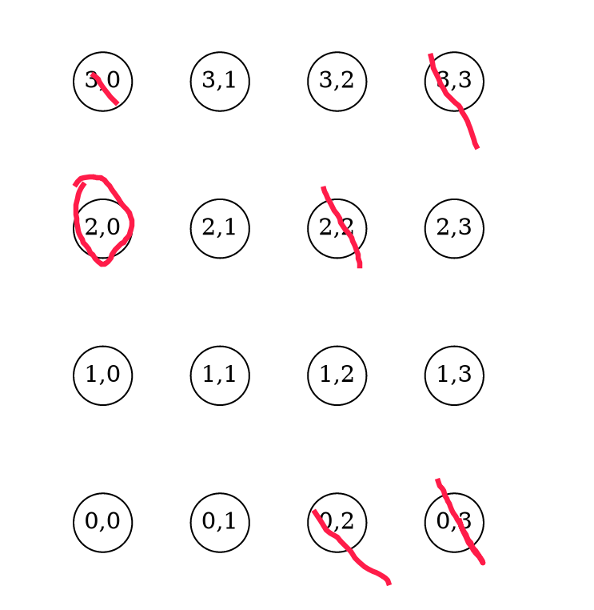

## 解析

### 思考1:暴力找斜率 $O(n^2logn)$

一定超时

### 思考2: 更进一步

证明:最小的的(x,y) 斜率,一定互质

因为只要用有约数,就可以消去(x/p,y/p),还是正整数,所以一定在矩阵内

题目就变成求互质的个数=>欧拉函数?



仔细看观察上面的图形,一行一行的看,每一行保留下来的点,都是和行数n互质的点,所以这里要用到欧拉函数:$<=n$中和n互质的数的数目


## 代码

```c
<%- include("1.cpp") %>
```

## 参考

- [题解 P2158 【[SDOI2008]仪仗队】 by JustinRochester](https://www.luogu.com.cn/blog/JustinRochester/solution-p2158)

