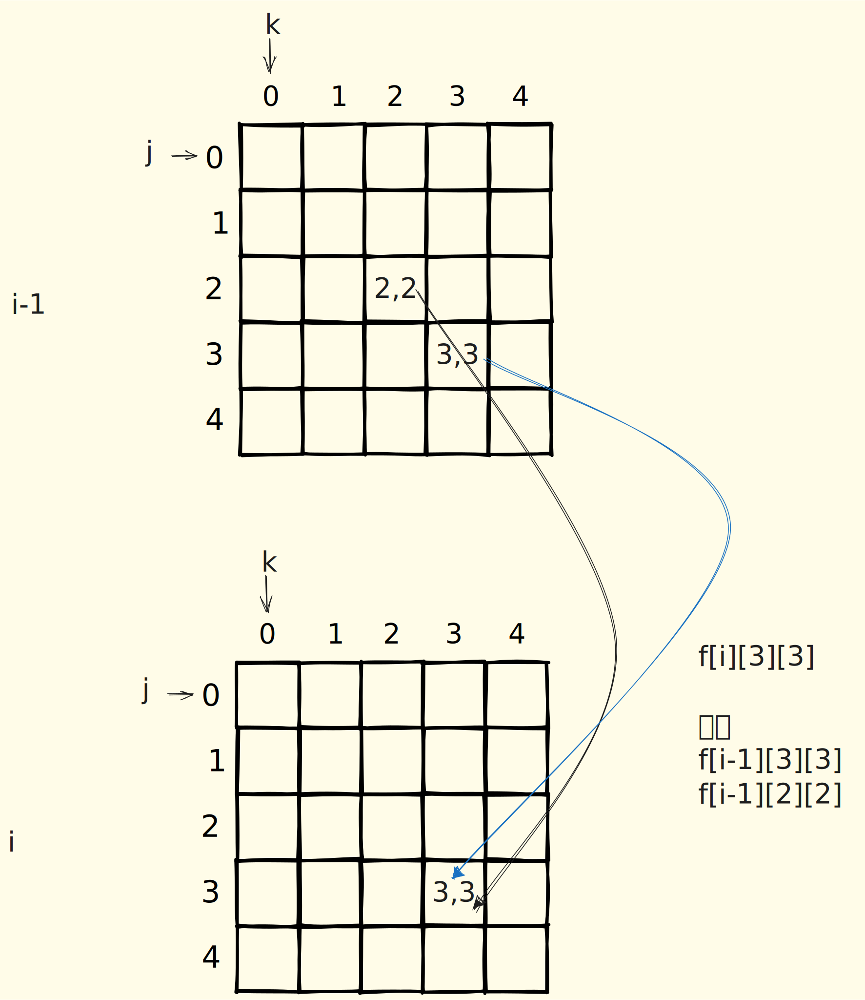

@[toc]

## 题目


### 题目描述

有两个仅包含小写英文字母的字符串 $A$ 和 $B$。

现在要从字符串 $A$ 中取出 $k$ 个互不重叠的非空子串，然后把这 $k$ 个子串按照其在字符串 $A$ 中出现的顺序依次连接起来得到一个新的字符串。请问有多少种方案可以使得这个新串与字符串 $B$ 相等？

注意：子串取出的位置不同也认为是不同的方案。


### 输入格式
第一行是三个正整数 $n,m,k$，分别表示字符串 $A$ 的长度，字符串 $B$ 的长度，以及问题描述中所提到的 $k$，每两个整数之间用一个空格隔开。

第二行包含一个长度为 $n$ 的字符串，表示字符串 $A$。

第三行包含一个长度为 $m$ 的字符串，表示字符串 $B$。


### 输出格式

一个整数，表示所求方案数。

由于答案可能很大，所以这里要求输出答案对 $1000000007$ 取模的结果。


### 样例


输入/输出 # 1

::: line
```
6 3 1 
aabaab 
aab
```

```
2
```
:::

输入/输出 # 2

::: line
```
6 3 2 
aabaab 
aab
```

```
7
```
:::

输入/输出 # 3

::: line
```
6 3 3 
aabaab 
aab
```

```
7
```
:::


### 说明/提示
  

对于第 1 组数据:$1≤n≤500,1≤m≤50,k=1$;  
对于第 2 组至第 3 组数据:$1≤n≤500,1≤m≤50,k=2$;   
对于第 4 组至第 5 组数据:$1≤n≤500,1≤m≤50,k=m$;   
对于第 1 组至第 7 组数据:$1≤n≤500,1≤m≤50,1≤k≤m$;  
对于第 1 组至第 9 组数据:$1≤n≤1000,1≤m≤100,1≤k≤m$;   
对于所有 10 组数据:$1≤n≤1000,1≤m≤200,1≤k≤m$。  


## 错误解析

先错一个错误的解析

我们把第一个字符串叫做`s1`,第二个字符串叫做`s2`

设`g[i][l][r]`表示**s1的第i个位置与s2[l,r]范围的字符串匹配的数量的前缀和**

设`f[i][j][k]`表示s1的后i个字符与s2的后j个字符分成k的的方案数


```
f[i][j][k] = sum{ calc_cnt(i,x,j,m) * f[x][j+m][k-1] }
```

`calc_cnt(i,x,j,m)` 表示s1从i开始到x结束与s2从j开始长度为m的匹配数量

这个状态转移方程是对的,但是时间复杂度特别高`n^2 *m^2 *k`

所以我们需要新的思考.得到新的状态转移方程 

## 正确解析

`f[i][j][k]`表示s1前i个元素,s2前j个元素匹配为k的方案数,

```
f[i][j][k] 
  = 

1. f[i-1][j][k]
2. f[i-1][j-1][k-1]    s1[i] == s2[j]
3. f[i-2][j-2][k-1]    s1[i] == s2[j] && s1[i-1] == s2[j-1]
....
```


根据上面的方程与边界,我们写出代码1,但是这个代码**超内存**

```
1000*200*200 * sizeof(long long) = 305.175 mb
```

但是如果我们只考虑70%数据,
```
1000*50*50 * sizeof(long long) = 19.175 mb
```
这样就能过`70%`的数据了,时间复杂度为`500*50*50*50`不超时,

```c
<%- include("1.cpp") %>
```


对于`90%`,数据

内存占用为

```
1000*100*100*100*sizeof(long long ) = 76.29mb
```

内存不会超,但是时间会超,时间为

```
1000*100*100*100 = 10^9
```

所以这个时候我们需要考虑,去除第四个循环,也就是枚举最后一次匹配的长度.

下面这个代码因为加入了`sum[maxn][maxe][maxe]`,整个内存达到了`76.29 * 2md`

会超内存

```
<%- include("2.cpp") _%>
```

我们改造一下代码,把k放最外层,且把sum变成二维`sum[maxn][maxne]`,也就是去除了k维

就可以过`90%`的数据了

```
<%- include("2_1.cpp") _%>
```

现在对于`100%`的数据,显然`f[maxn][maxne][maxne]`, 会超内存

我们需要像`01`背包那样思考🤔️,压缩一个维度,怎么压缩呢?



注意的一个问题,因为我们复用了`sum`,所以我们在使用新的sum前,需要清空`sum`

```
<%- include("2_2.cpp") _%>
```
