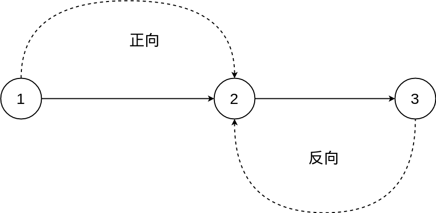

## 解析


核心的难点在于如何去求最大赚钱值?

如果简单的求出起点$1$到点$x$的最大卖出价$dmax[x]$,最小买入价$dmin[x]$,然后认为到$x$点的所赚的最大价值为$dmax[x]-dmin[x]$,**这是不对的**!因为不能保证$dmin[x]$在$dmax[x]$的前面.



如上图,把路径分成两个部分,前半部,后半部.只求前半部的$dmin[x]$,后半部的$dmax[x]$,这样就求出了一种差价(前半路径$1 \rightarrow x$,后半$x \rightarrow n$的差价).所有差价中最大的能那个就是答案!


方法一:用$Tarjan$缩点求出$DAG$,在$DAG$上进行两次$DP$,第一次,正向$DP$,求出$dmin$,第二次,反向$DP$,求出$dmax$

方法二:使用正反两次$spfa$,分别求出$dmin,dmax$


## 代码1: tarjan + 拓扑排序 +DP

```c
/* 
 * 建立一个基于的类与模板的 向量星
 * */

/*-----------------
* author: Rainboy
* email: rainboylvx@qq.com
* time: 2019年 05月 09日 星期四 10:14:11 CST
*----------------*/
#include <cstdio>
#include <cstring>
#include <vector>
#include <stack>
#include <algorithm>
using namespace std;

#define maxn 100005
#define maxe 500005

int n,m;
int price[maxn];
int color[maxn];


int _max[maxn]; //高价
int _min[maxn]; //低价

int f[maxn]; //表示从1号连通量 到当前的最小值
int dp[maxn]; //表示从1号连通量 到当前点的最大收益
int flag[maxn];

struct xlx{
    int edge_cnt=0;
    vector<int> head;
    vector<int> V;
    vector<int> U;
    vector<int> W;
    vector<int> next;

    /* 构造函数,点的数量 */
    xlx(int n){
        head = vector<int> (n,-1);
    }

    void add_edge(int u,int v,int w){
        U.push_back(u);
        V.push_back(v);
        W.push_back(w);
        next.push_back( head[u]);
        head[u] = edge_cnt;
        edge_cnt++;
    }

    void add_edge(int u,int v){
        U.push_back(u);
        V.push_back(v);
        next.push_back( head[u]);
        head[u] = edge_cnt;
        edge_cnt++;
    }
};

xlx x1(maxn);
xlx x2(maxn);
xlx x3(maxn);


int dfn[maxn],low[maxn],vis[maxn],idx=0;
bool instack[maxn];
int cnt = 0;
stack<int> sta;

void tarjan(int u){
    vis[u] = 1;
    dfn[u] = low[u] = ++idx;
    instack[u] = 1;

    sta.push(u);

    int i;
    for(i= x1.head[u];i!=-1;i=x1.next[i]){
        int v = x1.V[i];
        if(vis[v] == 0){
            tarjan(v);
            low[u] = min(low[u],low[v]);
        }
        else if( instack[v]){
            low[u] = min(low[u],dfn[v]);
        }
    }

    if( dfn[u] == low[u]){
        cnt++;
        int t = -1;
        while(t !=u){
            t = sta.top();
            instack[t] = false;
            color[t] = cnt;
            sta.pop();
        }
    }
}

vector<int> _sort;
void top_sort(int u){
    vis[u] = 1;
    int i;
    for (i=x2.head[u]; i!=-1;i=x2.next[i]){
        int v = x2.V[i];
        if(vis[v] == 0)
            top_sort(v);
    }
    _sort.push_back(u);
}

void init(){
    memset(_min,0x7f,sizeof(_min));
    memset(_max,-1,sizeof(_max));
    memset(f,0x7f,sizeof(f));

    scanf("%d%d",&n,&m);
    int i;
    for (i=1;i<=n;i++){
        scanf("%d",&price[i]);
    }
    int t1,t2,t3;
    for (i=1;i<=m;i++){
        scanf("%d%d%d",&t1,&t2,&t3);
        x1.add_edge(t1,t2);
        if( t3 > 1)
            x1.add_edge(t2,t1);
    }
    
}

int main(){
    init();
    int i,j;
    for (i=1;i<=n;i++){
        if( !dfn[i])
            tarjan(i);
    }

    /* 计算连通量下的 _max _min */
    for (i=1;i<=n;i++){
        int col = color[i];
        _max[col] = max(_max[col],price[i]);
        _min[col] = min(_min[col],price[i]);
    }

    /* 建立图 */
    for(i=0;i<x1.edge_cnt;i++){
        int u = x1.U[i];
        int v = x1.V[i];
        if( color[u] !=color[v]){
            x2.add_edge(color[u],color[v]);
            x3.add_edge(color[v],color[u]);
        }
    }

    memset(vis,0,sizeof(vis));
    for(i=1;i<= cnt;i++){
        if( vis[i] == 0)
            top_sort(i);
    }

    std::reverse(_sort.begin(),_sort.end());
    /*
     *for( auto x : _sort)
     *    printf("%d ",x);
     */
    
    /* 进行dp */

    flag[color[1]] = 1;
    f[color[1]] = _min[color[1]];
    dp[color[1]] = _max[color[1]] - _min[color[1]];

    for(i=2;i<=cnt;i++){

        int u = _sort[i];

        for(j= x3.head[u];j!=-1;j=x3.next[j]){
            int v = x3.V[j];
            if( flag[v]){
                f[u] = min(f[v],_min[u]);
                int t = max(dp[v],_max[u] - f[u]);
                dp[u] = max(dp[u],t);
                flag[u] = 1;
            }
        }

        if( u == color[n])
            break;
    }
    printf("%d",dp[color[n]]);
    return 0;
}
```

## 代码2: 两遍SPFA


```c
/*-----------------
* author: Rainboy
* email: rainboylvx@qq.com
* time: 2019年 05月 09日 星期四 11:21:43 CST
* problem: noip2009-题目3:最优贸易
*   
*   使用 两遍 spfa
*----------------*/
#include <cstdio>
#include <vector>
#include <cstring>
#include <queue>
#include <algorithm>
using namespace std;

#define maxn 100005

int n,m;
int p[maxn];

int _fmin[maxn]; //从起点1 到点i的最小点值
int dp[maxn]; //从起点1 到点i的最大收益


struct xlx{
    int edge_cnt=0;
    vector<int> head;
    vector<int> V;
    vector<int> U;
    vector<int> W;
    vector<int> next;

    /* 构造函数,点的数量 */
    xlx(int n){
        head = vector<int> (n,-1);
    }

    void add_edge(int u,int v,int w){
        U.push_back(u);
        V.push_back(v);
        W.push_back(w);
        next.push_back( head[u]);
        head[u] = edge_cnt;
        edge_cnt++;
    }

    void add_edge(int u,int v){
        U.push_back(u);
        V.push_back(v);
        next.push_back( head[u]);
        head[u] = edge_cnt;
        edge_cnt++;
    }
};

xlx x(maxn);


void init(){
    memset(_fmin,0x7f,sizeof(_fmin));
    scanf("%d%d",&n,&m);
    int i;
    for (i=1;i<=n;i++){
        scanf("%d",&p[i]);
    }

    int t1,t2,t3;
    for (i=1;i<=m;i++){
        scanf("%d%d%d",&t1,&t2,&t3);
        x.add_edge(t1,t2);
        if( t3 > 1)
            x.add_edge(t2,t1);
    }
}

queue<int> q;
bool in_q[maxn];

void spfa__fmin(int s){
    memset(in_q,0,sizeof(in_q));
    _fmin[s] = p[s]; //起点
    in_q[s] = 1;
    q.push(s);

    while(!q.empty()){
        int u = q.front(); q.pop();

        in_q[u] = 0;

        int i;
        for(i=x.head[u];i!=-1;i= x.next[i]){
            int v = x.V[i];
            int t= min(_fmin[u],p[v]);
            if( _fmin[v] > t){
                _fmin[v] = t;
                if( !in_q[v]){
                    in_q[v] = 1;
                    q.push(v);
                }
            }
        }
    }
}

void spfa_dp(int s){
    memset(in_q,0,sizeof(in_q));
    dp[s] = 0;
    in_q[s] = 1;
    q.push(s);

    while(!q.empty()){

        int u = q.front(); q.pop();

        in_q[u] = 0;

        int i;
        for(i=x.head[u];i!=-1;i= x.next[i]){
            int v = x.V[i];
            int t = max(p[v]-_fmin[v],dp[u]);
            if( dp[v] < t){
                dp[v] = t;
                if( !in_q[v] ){
                    in_q[v] = 1;
                    q.push(v);
                }
            }
        }
    }
}


int main(){
    init();
    spfa__fmin(1);
    spfa_dp(1);
    printf("%d",dp[n]);
    return 0;
}
```

