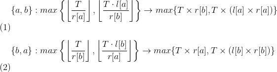

## 解析


核心难点:**贪心正确性的证明!**

我们先假设在原始序列中，有相邻的两个人a和b。我们发现这样的性质。交换a和b的位置。只会使a和b的价值改变。不会影响a和b前面的序列的人。和后面序列的人的价值。


```viz-dot
digraph title {
    node[shape=rect,label=""];
    a,b,c,d;
    x[label="a"];
    y[label="b"];
    1,2,3,4;
}
```



由于保证$l[i],r[i](i\in [1,n])\gt0$，所以上述式子就化简为比较$T\times(l[a]\cdot r[a])$与$T\times(l[b]\cdot r[b])$大小。易知为了满足最优，必须有$l[a]\cdot r[a]<l[b]\cdot r[b]$。


根据上面的证明。发现。满足条件的a和b交换后。只针对于a和b的数值变小了。假设交换完之后新形成的序列为s。那么s就变成原序列的值问题。我们对s进行同样的这种操作可以使数值进一步减小。因为每一次，这种操作都可以使局部值尽可能的变小。进而使整体值也尽可能的变小。

所以我们只要针对$l[i] \cdot r[b]$进行排序即可.这里用到了高精度除法和高精度比较.

## 代码

```c
<%-include("2.cpp")%>
```


