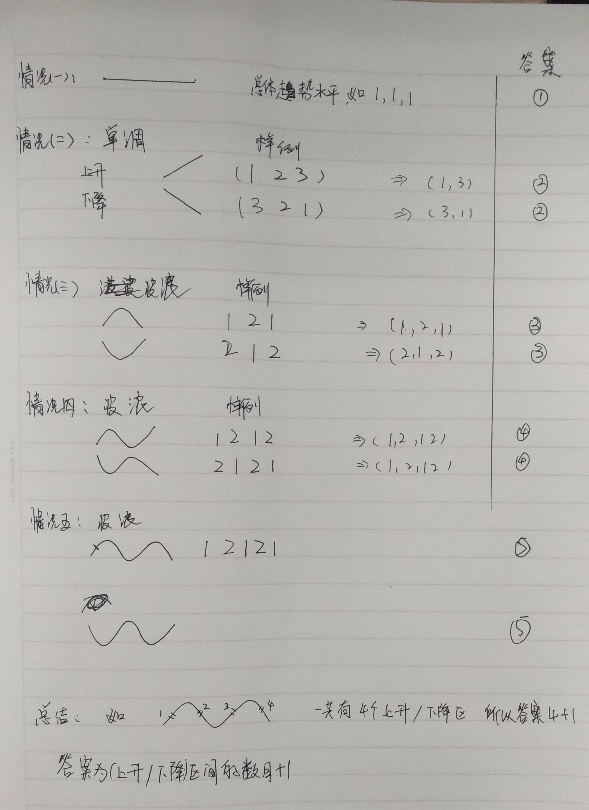

## 解析

把样例解析一遍之后,发现样例是一个如下图的走势:左边上升,右边下降.

```plaintext
   5
    \
   3 \
    2 \ / 2
       X
       1
```

我们讨论一下:




## 代码

```c
/*-----------------
* author: Rainboy
* email: rainboylvx@qq.com
* time: 2019年 07月 01日 星期一 10:42:14 GMT
* problem: luogu-1970
*----------------*/
#include <bits/stdc++.h>
using namespace std;

#define maxn 1000005
int n;
int a[maxn];
int ans = 0;

void init(){
    scanf("%d",&n);
    int i;
    for (i=1;i<=n;i++){
        scanf("%d",&a[i]);
    }
}
int main(){
    init();
    int i,pre;


    // 找到第一个 上升/下降
    for(i=2;i<=n;i++){
        if( a[i] != a[i-1]){

            if( a[i] < a[i-1]){
                pre = 0;  //下降
                ans = 1;
            }
            else if ( a[i] > a[i-1]){
                pre = 1;
                ans = 1;
            }
            break;
        }
    }

    for (i=i+1;i<=n;i++){
        if( a[i] > a[i-1] && pre == 0){
            pre = 1;
            ans++;
        }
        else if( a[i] < a[i-1] && pre == 1){
            pre = 0;
            ans++;
        }
    }
    printf("%d\n",ans+1);
    return 0;
}
```
